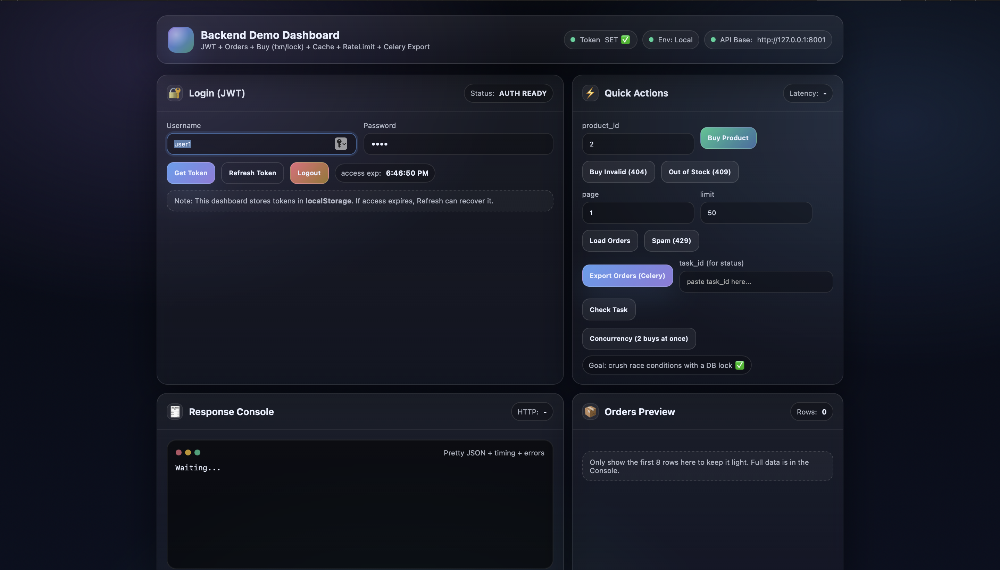

# Backend Shop – Django REST Demo (Docker + Postgres + Redis + Celery)

## Dashboard Preview



Backend-first Django project built to show practical backend work:
JWT auth, concurrency-safe purchases, caching, rate limiting, async export with Celery, request tracing, and a small demo dashboard to trigger flows fast.

No production setup. Clean local/dev workflow that runs the same on any machine with Docker.

---

## What’s inside

- **JWT Authentication** (SimpleJWT)
- **Orders API** with pagination, ordering, filtering, optimized queries
- **Purchase API** with `transaction.atomic()` + `select_for_update()` to prevent race conditions / overselling
- **Rate limiting**
  - DRF throttling configuration
  - Extra manual rate limit example (legacy endpoint)
- **Caching**
  - Local memory cache (Django cache) for fast endpoints / rate limiting demo
  - Cache invalidation on purchase
- **Celery background task**
  - Export orders as CSV string (MVP)
  - Task status endpoint using `AsyncResult`
- **Request ID logging middleware**
  - Adds `X-Request-ID` header
  - Logs one structured line per request (request_id, method, path, status, duration, ip)
- **Admin pages** for Product/Order/OrderItem
- **Tests**
  - Buy success
  - Out-of-stock handling
  - Orders permission scope

---

## Stack

- Python + Django + Django REST Framework
- PostgreSQL
- Redis
- Celery
- Docker / Docker Compose

---

## Project layout

- `core/` Django project config (settings, urls, celery app)
- `shop/` main app (models, serializers, viewsets, endpoints, celery tasks, middleware)
- `shop/templates/shop/demo.html` demo dashboard (HTML) to trigger API calls
- `docker-compose.yml` local services (db, redis, web, celery)
- `Dockerfile` base image for both `web` and `celery`
- `requirements.txt` pinned dependencies

---

## Run with Docker (recommended)

### 1) Build and start services

```bash
docker compose up --build

2) Apply migrations (first run)

docker compose exec web python manage.py migrate

3) Create a demo user (for dashboard login)

docker compose exec web python manage.py shell -c "
from django.contrib.auth.models import User
User.objects.filter(username='user1').delete()
User.objects.create_user('user1', password='1234')
print('created user1')
"

4) Create products + seed orders

docker compose exec web python manage.py shell -c "
from shop.models import Product
Product.objects.all().delete()
[Product.objects.create(name=f'P{i}', price=100+i, stock=10) for i in range(1,6)]
print('products=', Product.objects.count())
"

docker compose exec web python manage.py seed_orders


⸻

App URLs

Demo dashboard (UI)
	•	http://127.0.0.1:8001/dashboard/demo/

This page triggers:
	•	Login (JWT)
	•	Buy product
	•	Load orders
	•	Rate limit spam
	•	Celery export + status check
	•	Concurrency test (2 purchases at once)

Important note: the dashboard uses JWT. It does not rely on Django session login.

API
	•	JWT token: POST /api/token/
	•	JWT refresh: POST /api/token/refresh/
	•	Buy: POST /api/buy/
	•	Orders list: GET /api/orders/
	•	Export orders: POST /api/reports/orders/export/
	•	Export status: GET /api/reports/orders/export/status/?task_id=...

⸻

Quick API usage (curl)

Get JWT tokens

curl -s -X POST http://127.0.0.1:8001/api/token/ \
  -H "Content-Type: application/json" \
  -d '{"username":"user1","password":"1234"}'

Copy access and use it:

ACCESS="PASTE_ACCESS_TOKEN"

List orders

curl -s http://127.0.0.1:8001/api/orders/?ordering=-created_at \
  -H "Authorization: Bearer $ACCESS"

Buy product (concurrency-safe)

curl -s -X POST http://127.0.0.1:8001/api/buy/ \
  -H "Authorization: Bearer $ACCESS" \
  -H "Content-Type: application/json" \
  -d '{"product_id":2}'

Expected responses:
	•	201 success → { "order_id": ..., "remaining_stock": ... }
	•	409 out of stock → { "error": "OUT_OF_STOCK" }
	•	400 invalid input → serializer validation error body

Start export (Celery)

curl -s -X POST http://127.0.0.1:8001/api/reports/orders/export/ \
  -H "Authorization: Bearer $ACCESS"

Response includes task_id.

Check export status

TASK_ID="PASTE_TASK_ID"
curl -s "http://127.0.0.1:8001/api/reports/orders/export/status/?task_id=$TASK_ID" \
  -H "Authorization: Bearer $ACCESS"


⸻

Core backend guarantees

Purchase safety (no overselling)

Purchase flow uses:
	•	transaction.atomic()
	•	Product.objects.select_for_update() row lock
	•	stock decrement inside the same transaction

This prevents race conditions even when multiple requests hit the same product at the same time.

Orders performance

Orders viewset uses:
	•	.select_related("user")
	•	.prefetch_related("items__product")

This reduces query count and avoids N+1 patterns.

Request traceability

Middleware adds:
	•	unique request id per request
	•	X-Request-ID response header
	•	structured logs including duration

⸻

Legacy demo endpoints (optional)

These endpoints exist to demonstrate concepts quickly:
	•	/orders/slow/ shows N+1 query behavior (intentionally)
	•	/orders/fast/ manual pagination + caching + manual IP rate limit
	•	/orders/buy/ session-based buy endpoint (legacy) with locking and cache invalidation

The main API for real use is under /api/....

⸻

Tests

Run tests inside Docker:

docker compose exec web python manage.py test

Covers:
	•	buy success
	•	out of stock
	•	orders permission scope

⸻

Admin

Admin is available after creating a superuser:

docker compose exec web python manage.py createsuperuser

Then open:
	•	http://127.0.0.1:8001/admin/

Admin includes:
	•	Product list/search
	•	Orders with inline OrderItems
	•	OrderItem list

⸻

Environment / settings

Docker uses:
	•	PostgreSQL container (service name db)
	•	Redis container (service name redis)

core/settings.py reads database config from env vars with defaults.

Celery config:
	•	CELERY_BROKER_URL → Redis
	•	CELERY_RESULT_BACKEND → Redis

⸻

Troubleshooting

“ports are not available” for Redis (6379)

Another Redis is already using port 6379 on the host.

Fix options:
	•	stop the local Redis service, or
	•	change the host port in docker-compose.yml (example: 6380:6379)

“could not translate host name ‘db’”

This happens when running Django locally while settings point to Docker service names.

Fix:
	•	run via Docker, or
	•	set POSTGRES_HOST=127.0.0.1 for local runs

Unapplied migrations warning

Apply migrations:

docker compose exec web python manage.py migrate

Demo dashboard redirects to /accounts/login/

That means Django session login is required for the dashboard view.
This project is meant to use JWT for dashboard actions, so the dashboard should be reachable without session login.

If the dashboard view is decorated with login_required, remove that decorator (optional) or ensure a login route exists.
JWT calls will still work either way.

⸻

Notes
	•	The CSV export returns a CSV string (MVP). Storing files (S3/local volume) is intentionally out of scope.
	•	The Docker setup is for local/dev demonstration, not production deployment.

⸻


